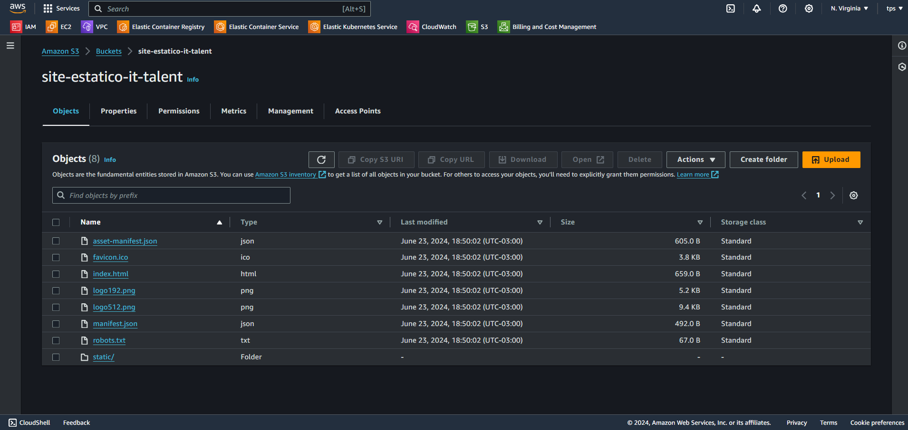
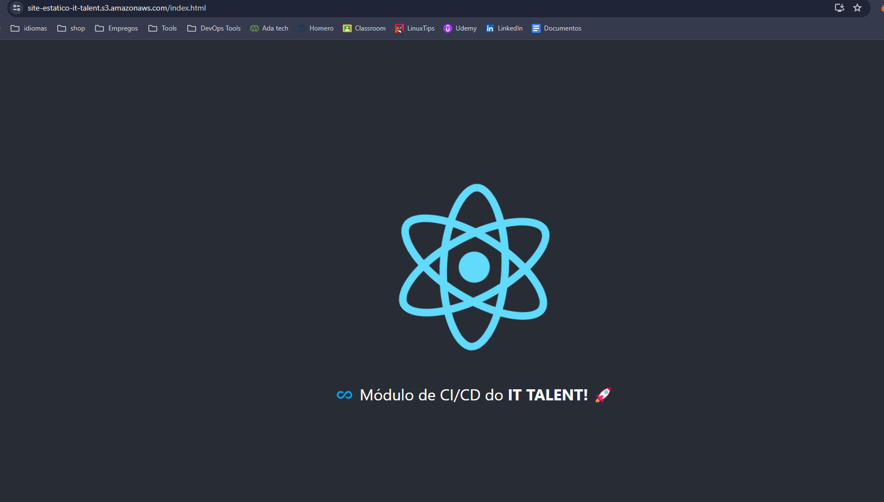

# 3° Hackathon do curso DevOps - IT Talent

O mesmo consistiu em dois desafios diferentes com tecnologias que tivemos contato durante o curso.

## Sonarqube
O primeiro desafio foi a analise de um projeto com o Sonarqube, rodei ele em um container, localmente, no docker.
O SonarScanner CLI, baixei no windows e configurei o mesmo para realizar o scanneamento do projeto.

### Imagem docker utilizada
- $ docker run -d --name sonarqube -e SONAR_ES_BOOTSTRAP_CHECKS_DISABLE=true -p 9000:9000 sonarqube:latest

### prints comprobatório

## CI/CD com Github Actions e AWS
O segundo desafio foi criação de um workflow do Github Actions que realizou o build de uma aplicação React e, em seguida, subiu o conteúdo desse build para um bucket S3 da AWS, vale ressaltar que o bucket tinha que estar configurado para ser acessível publicamente.

### prints comprobatório

 